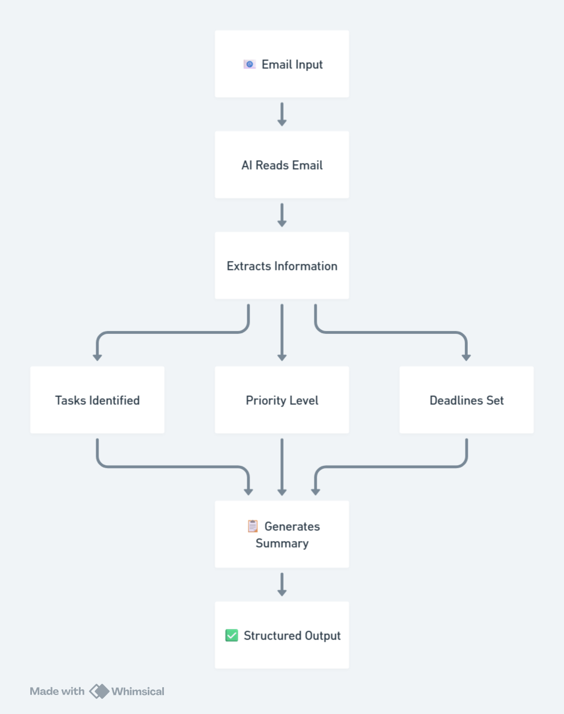

# 📧 AI Email → Task Automation Agent

An AI-powered workflow system that converts unstructured emails into structured tasks, summaries, and actionable insights automatically.

---

## 🚀 Problem

Teams spend hours manually:
- Reading emails
- Identifying tasks
- Tracking follow-ups

This leads to:
- Missed actions
- Poor tracking
- Wasted time

---

## 💡 Solution

This AI agent automatically:

- Understands email content
- Extracts actionable tasks
- Assigns priority
- Generates a concise summary
- Outputs structured data

---

## 🔄 Workflow

Email Input  
↓  
AI Processing (Gemini + Agent)  
↓  
Task Extraction  
↓  
Summary Generation  
↓  
Structured Output  




---

## 📦 Output Example

```json
{
  "tasks": [
    {
      "task": "Follow up with client",
      "priority": "High",
      "deadline": "Tomorrow"
    },
    {
      "task": "Send updated pricing",
      "priority": "High",
      "deadline": "Tomorrow"
    },
    {
      "task": "Schedule client demo",
      "priority": "Medium",
      "deadline": "Next week"
    }
  ],
  "summary": "Client is interested but needs pricing update and demo scheduling",
  "metadata": {
    "sender": "client@example.com",
    "category": "Sales"
  }
}